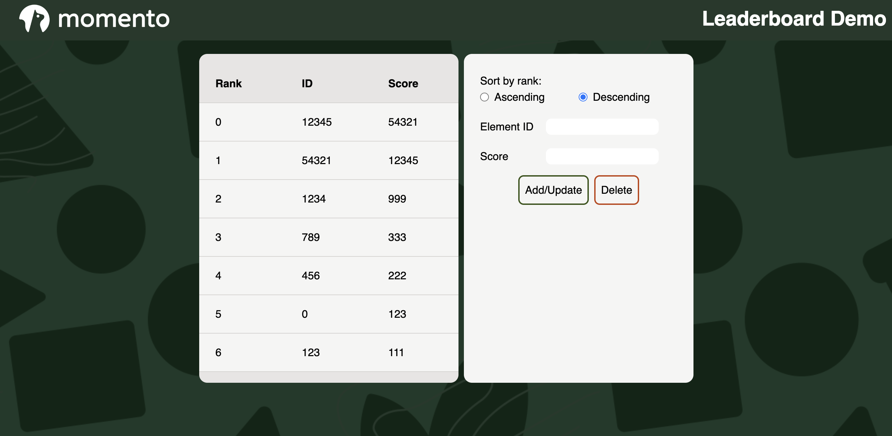

# Leaderboard Demo Using the Momento Web SDK

In this directory, you'll find a simple Vite + React web application to showcase some of the key features of Momento Leaderboard. 
A simple leaderboard component displays each element's ID, score, and rank (in either ascending or descending order), and you can use the entry form to add, update, or remove elements.



## Prerequisites

In order for this project to run, you will need:

- A Momento API key. You can get one from the [Momento Console](https://console.gomomento.com). Check out the [getting started](https://docs.momentohq.com/cache/getting-started) guide for more information on obtaining an API key.
- A Momento cache, which you can create in the [Momento Console](https://console.gomomento.com). Check out the [getting started](https://docs.momentohq.com/cache/getting-started) guide for more information on creating a cache.


## Getting Started

First, install all dependencies:

```
npm install
```

Create a `.env` file in this directory and provide your Momento API key and pre-created cache name:

```
VITE_MOMENTO_API_KEY="<your-api-key>"
VITE_MOMENTO_CACHE_NAME="<your-cache-name>"
```

Then run the project and navigate to `http://localhost:5173/` to see the demo in action!

```
npm run dev
```